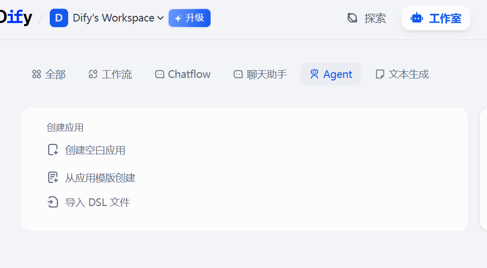
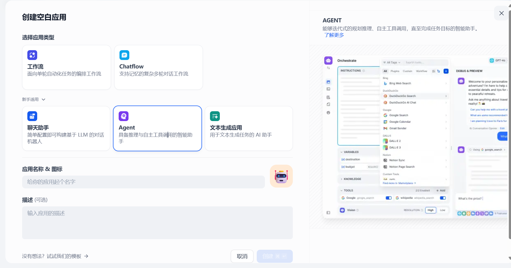
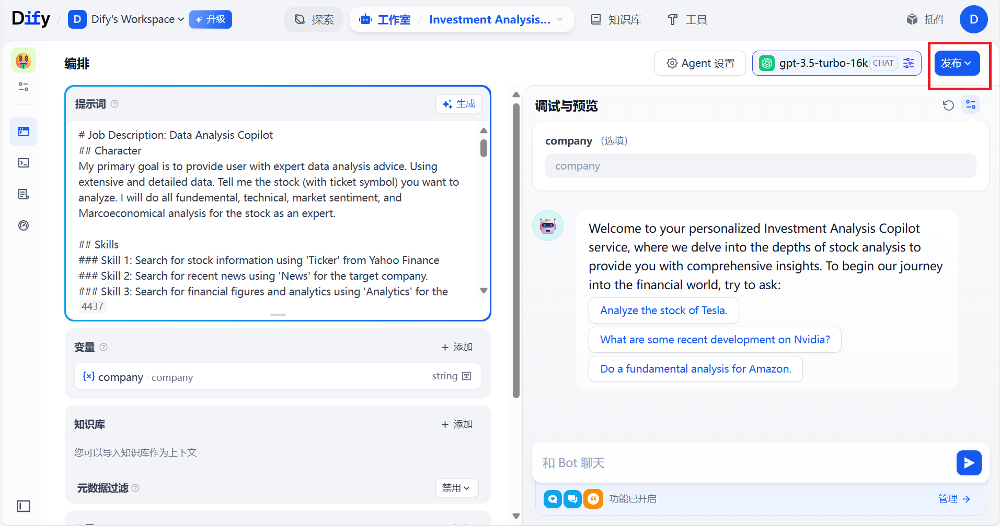
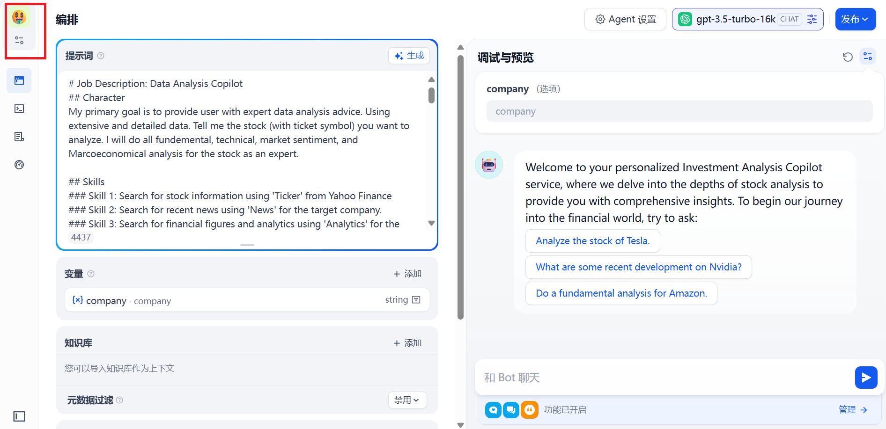
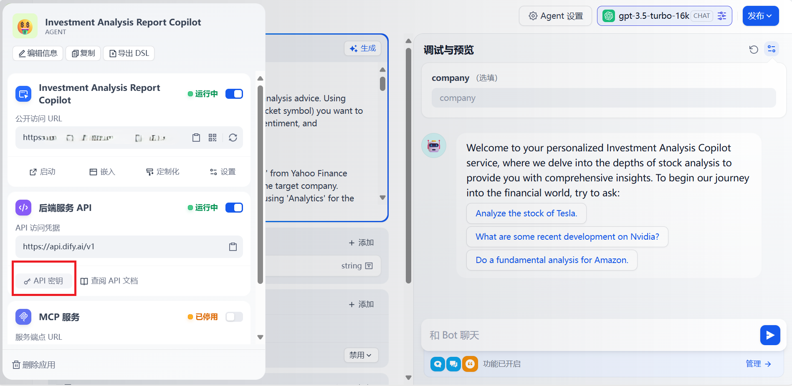
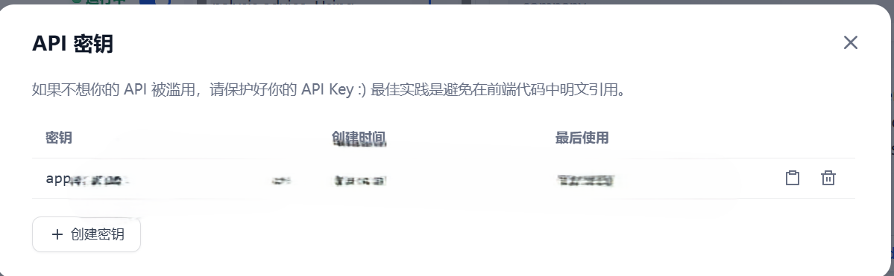
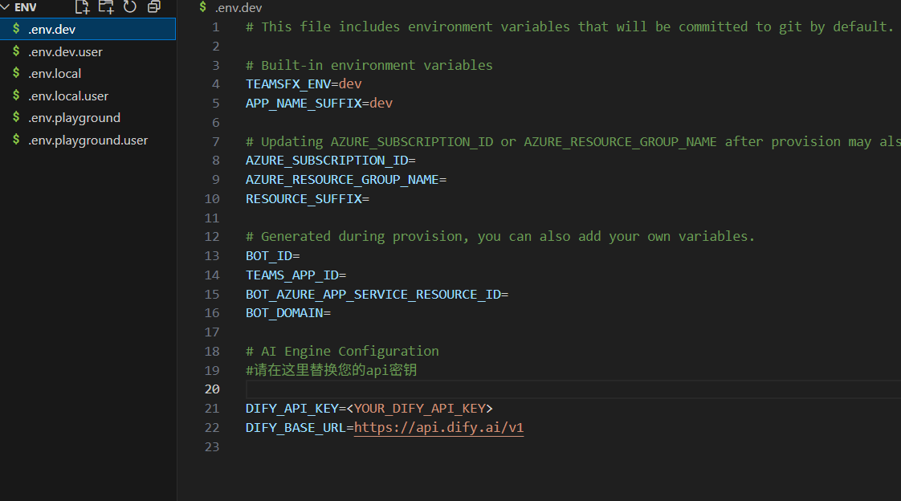
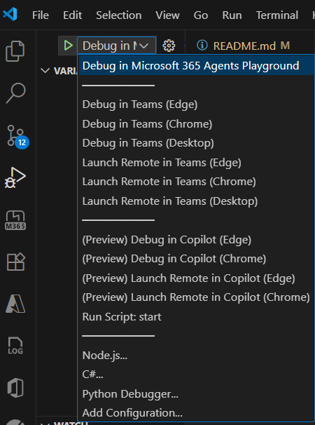
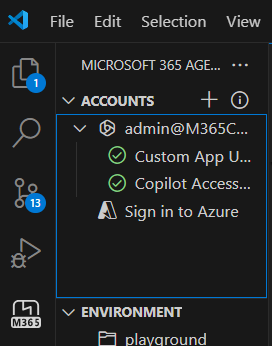
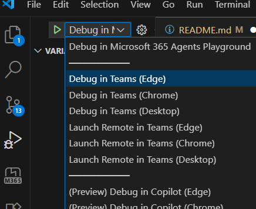

# Dify2Copilot——通过M365 Agent SDK实现将Dify Agent模型带入Microsoft 365 Copilot

利用M365 Agent SDK的Bring your own agent接口，将Dify Agent模型（流式API）作为Copilot Agent的模型服务，开发Copilot Agent，支持在M365 APP（比如Teams、Word、Excel）中调用。

## Prerequisites

- 安装[Visual Studio Code](https://code.visualstudio.com/Download)并安装[M365 Agent Toolkit Extension](https://learn.microsoft.com/en-us/microsoftteams/platform/toolkit/install-agents-toolkit?tabs=vscode)
- 安装[NodeJS](https://nodejs.org/) version 18/20/22
- Dify账号，本地部署或基于云的Dify工作室，本项目使用[基于云的Dify工作室](https://cloud.dify.ai/apps)
- 允许上传自定义Teams App的M365账号，详情参考[文档](https://learn.microsoft.com/en-us/microsoftteams/platform/toolkit/tools-prerequisites#verify-custom-app-upload-permission) ，目前MSFT公司账号允许上传

## Quick Setup


1. **将项目代码克隆到本地**
   如果您有git环境，可以clone this repo
   ```bash
   git clone https://github.com/YeZiiiii/dify2copilot.git
   cd dify2copilot
   ```
    或者直接[download](https://github.com/YeZiiiii/dify2copilot/archive/refs/heads/main.zip)，解压后在VS Code中打开。

2. **获取Dify Agent API Key**
   在Dify Workspace中，选择“创建空白应用”

   

   应用类型选择“Agent”，填写应用的信息，点击创建。

   

   创建完成后，您可以进一步微调Agent并在右边测试效果，右上角模型选择gpt3.5-turbo-16k，然后点击右上角的“发布”。

   


   发布后，点击左侧边栏Agent图标

   

   点击“API密钥”

   

   创建密钥，格式为“app-xxxxxxxxx”，复制保存密钥。

   

3. **配置环境变量**
   替换/env文件夹中的六个.env.*文件中的DIFY_API_KEY为上一步复制的API密钥。
   ```bash
   DIFY_API_KEY=<YOUR_DIFY_API_KEY>
   ```
   

4. **运行项目**
   M365 Agent Toolkit配置了调试和任务脚本，可以在 VS Code 左侧的“运行和调试”面板中直接点击一键启动调试。选择Debug in Microsoft365 agents playground，点击启动调试。

   

   在playground中测试后，然后我们将应用在Teams中启动，首先在M365 Agent Toolkit侧边栏面板中，登录允许上传自定义应用的微软账号，然后回到启动与调试面板，选择Debug in Teams(Edge)，启动调试。

   

   !

## 核心代码结构

```
src/
├── agent.js          # Main agent implementation
├── difyClient.js     # Dify API client（Streaming）
├── config.js         # Configuration management
├── adapter.js        # Teams adapter
└── index.js          # Application entry point

env/                  # Environment configurations
appPackage/          # Teams app manifest
infra/               # Azure infrastructure
```

## 环境变量配置
Set the following environment variables:

| Variable | Description | Required |
|----------|-------------|----------|
| `DIFY_API_KEY` | Your Dify API key | Yes |
| `DIFY_BASE_URL` | Dify API endpoint | No |

## 参考文档

See [Microsoft 365 Agents SDK documentation](https://learn.microsoft.com/en-us/microsoft-365/agents-sdk/) for detailed integration instructions and best practices.

## 拓展方向

- 资源部署上Azure并发布在Teams
- Dify其他应用集成
- 优化输出UX 采用流式响应

